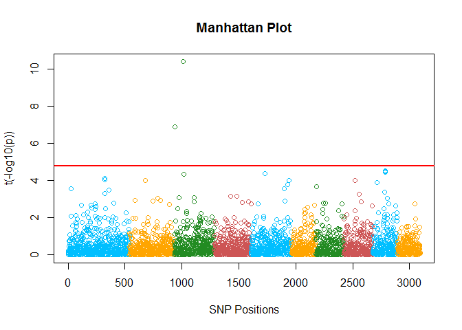
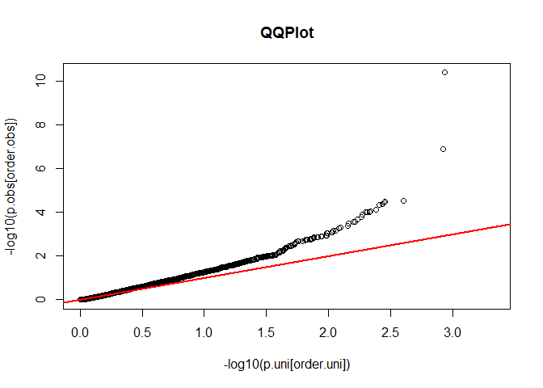

<!-- README.md is generated from README.Rmd. Please edit that file -->
<!-- badges: start -->
<!-- badges: end -->


GWASbyGLM
---------

The goal of GWASbyGLM is to perform Genome Wide Association Studies using Generelized linear model.THe final goal is to assess the association of genotypes with traits.

Installation
------------

You can install the development version from [GitHub](https://github.com/) with:

``` r
# install.packages("devtools")
devtools::install_github("cswarnita/GWASbyGLM")
```

Example
-------

This is a basic example which shows you how to solve a common problem:

``` r
library(GWASbyGLM)
## basic example code
```

Import Data
-----------

``` r
#Import Data
myGD=import_data(filename = "http://zzlab.net/GAPIT/data/mdp_numeric.txt")
myGM=import_data(filename = "http://zzlab.net/GAPIT/data/mdp_SNP_information.txt")
phenotype=import_data(filename="http://zzlab.net/GAPIT/data/CROP545_Phenotype.txt")
```

Perform PCA
-----------

``` r
#This functions perform Principal Component across the Markers.
# Exclude PCs linearly dependent with covariates (if there is any covariate information available)
cofactors_PC= PC(2,myGD[,-1],C=NULL);head(cofactors_PC) 
#> Warning in rm(c): object 'c' not found
#> Warning in rm(tmp): object 'tmp' not found
#>              PC1        PC2
#> [1,]   1.6780775 -4.9373382
#> [2,]  -1.6021749 -4.7322790
#> [3,]  -0.8999517 -6.2186090
#> [4,]   2.1334477 -6.2879301
#> [5,]   0.6302372 -4.8947416
#> [6,] -13.6690754  0.8736302
```

Perform GWAS
------------

``` r
#This function returns the p-values for each Markers
p_val=p_val_GLM(y=phenotype[,-1],X=myGD[,-1],PC=cofactors_PC)
#Manhattan Plot
manhattan_plot(data=myGM,cutoff = 0.05,p=p_val)
```



``` r

#QQPlot
QQPlot_GWAS(p=p_val)
```



``` r

#False Positive
source("http://zzlab.net/StaGen/2020/R/G2P.R")
X=myGD[,-1]
index1to5=myGM[,2]<6
X1to5 = X[,index1to5] # Subset genotypic matrix based on Chromosome 1-5
mySim=G2P(X=X1to5,h2=0.75,alpha=1,NQTN=10,distribution="normal")
y=mySim$y
fp_GLM=false_positive(P=p_val,QTN.position = mySim$QTN.position,cutoff = 0.05);fp_GLM
#> [1] 0.03491756
```
